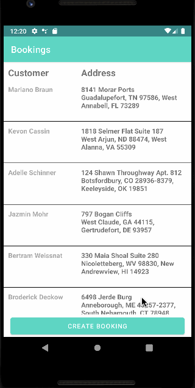

# Spruce booking app

Our internal operations team would like a basic mobile app that lets them perform basic CRUD operations on bookings. Your requirements are below - how you approach them is up to you but plan to spend 4 hours completing this exercise. The full list of requirements isn't mandatory so plan accordingly. Feel free to add as much (or as little) context as you'd like explaining your decisions. When you submit, be sure all files are committed to the repo.

## 🖥 Booking UI
* Should match the attached mockups
* Should use native Android or iOS (we use Kotlin and Swift)
* Should support CRUD operations for two types of bookings:
    * Housekeeping
    * Dog walks
* Should list bookings in ascending order by date
* Should let the user create a new booking and require the following data:
    * Email
    * Name
    * Address
    * Booking Type (housekeeping, dog walk)
    * Booking Date
    * Booking Time
* Should display the booking details in a separate details page
* Should let the user update one or all of the booking properties
* Should let the user cancel a booking

## 🧰 Booking API
* GQL Schema is defined here: https://studio.apollographql.com/sandbox/explorer?endpoint=https%3A%2F%2Fqz1l95.sse.codesandbox.io%2F&explorerURLState=N4IgJg9gxgrgtgUwHYBcQC4QEcYIE4CeABABQAkAZgJYA2K%2BAQgekQxBANZVIDmAYrXp4AkkgAOMFAEoiwADpIiRAEbsuvAM4lqdRsyKVBemfMVKiKCCgCGNBeZVruPDbPsOiVMO4cI412h9zFAIxBCClDRsUGA0IoiRrRHjrMDA8BA04swcNfAA3KigEABFreiCAX3dqpEqQABoQfOs8KmtlGkyMEFMlORAdISYBlj7zAajy2NGiAdEABTwIHgysgZqFesqgA

## 💯 Bonus points
* Add pagination (fill screen with enough items to avoid scrolling)!
* Add functionality to filter bookings by any field!
* Input validation!
* Add unit tests!

## Video Walkthrough

Here's a walkthrough of implemented user stories:

